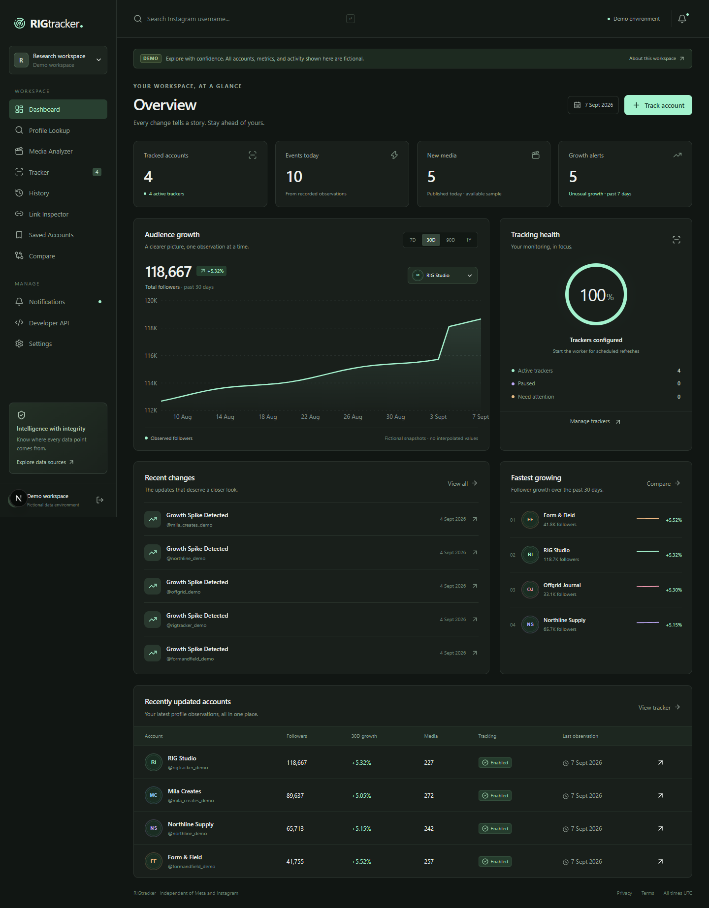
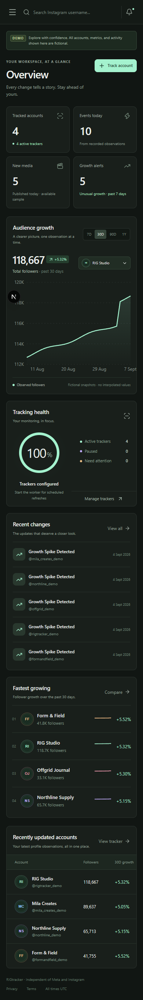

# RIGtracker

**Instagram intelligence, organized.** A modular local SaaS MVP for authorized profile research, historical observations, media analytics and scheduled monitoring. Built with Next.js **16.3.4** (verified from the registry on 2026-09-07), strict TypeScript, React, Tailwind CSS, Recharts, PostgreSQL and Redis. The server routes, provider adapters and worker are TypeScript; FastAPI is not used.

RIGtracker is independent of Meta and Instagram. It does not scrape Instagram, collect Instagram passwords/cookies, retrieve hidden contact information, or bypass access controls.

## Start locally

Requires Node.js 24 and npm. Docker is optional for local mock development.

```powershell
npm ci
Copy-Item .env.example .env.local
npm run dev
```

Open [RIGtracker locally](http://127.0.0.1:3000), select **Open workspace**, then **Explore the fictional demo**. This creates an isolated database workspace and session. You can also create a persistent RIGtracker account with an email and a password of at least 12 characters. This is not an Instagram login. Use `127.0.0.1`, or change `APP_URL` to match the exact origin you use; CSRF validation intentionally rejects a different origin such as `localhost`.

With `DATABASE_URL` empty, development uses PGlite, an embedded PostgreSQL engine, stored at `.data/postgres`. Tables, constraints and migrations are PostgreSQL SQL, not an unrelated JSON datastore. PGlite is a **single-process development option**. Do not run a separate migration process while the dev server has the same embedded database open. For production, PostgreSQL and Redis are mandatory and checked at startup. Local cache/rate limiting is process-local when Redis is absent.

The application applies versioned migrations once on first database use, protected by a PostgreSQL advisory lock. For an explicit migration (with the dev server stopped when using PGlite):

```powershell
npm run db:migrate
```

## What you can do

- Search five named fictional profiles, save accounts, add notes and tags.
- Explore **366 daily snapshots and 48 media items per account**: 1,830 snapshots, 240 media items and thousands of field-change events. The required account is `@rigtracker_demo`; the others are `@northline_demo`, `@formandfield_demo`, `@mila_creates_demo`, and `@offgrid_demo`.
- See username, name, biography, avatar, website, followers, following and media-count differences. Stable provider IDs preserve identity across username changes.
- Filter history by field and 24H/7D/30D/90D/1Y/all periods, inspect text/photo differences, and export observations/events as CSV.
- Analyze images, videos, carousels and Reels; filter captions and types; inspect null-aware engagement and performance ratios.
- Compare 2–5 tracked accounts with recorded audience curves and derived metrics.
- Create, pause, resume, remove and configure hourly-to-weekly trackers, notification preferences and follower thresholds.
- Read and acknowledge in-app notifications; clean Instagram links without remote fetching; export or delete the entire local workspace.
- Inspect the internal API at `/developers`, and its schema at `/api/openapi.json`.

All mock data, including media artwork made of typographic fixture cards, is fictional. No demo item links to an invented real Instagram post. Unknown usernames return an unavailable state; the mock provider does not fabricate an account for arbitrary input.

## Screenshots

Browser tests write reproducible screenshots here:





## Architecture

```text
Browser / Next.js App Router
  ├─ workspace screens and composable chart/UI components
  ├─ authenticated /api/v1 routes with CSRF + validation + rate limits
  ├─ domain analytics (no Meta response objects)
  └─ services → repositories → PostgreSQL
                  └─ InstagramProvider
                       ├─ MockProvider (fictional fixtures)
                       └─ MetaProvider (authorized Instagram Login)

Scheduler process → authenticated internal tick route
                  → durable PostgreSQL claims / leases
                  → refresh service → events → notification rules
Redis → request budgets, cache, provider backoff
```

Directory responsibilities:

- `src/domain`: normalized types, nullable metric math, API catalog and schemas.
- `src/providers/instagram`: provider interface, mock fixtures, Meta adapter, normalization and normalized exceptions.
- `src/services`: snapshot diffing, refresh orchestration, notification triggers, scheduling, OAuth and safe link parsing.
- `src/repositories`: user-scoped persistence and fixture seeding.
- `src/server`: database adapter, centralized environment settings, authentication, encryption, cache and HTTP envelopes.
- `src/components`, `src/screens`, `src/app`: composable controls, product views and routes.
- `migrations`: versioned PostgreSQL SQL with normalized relational tables and targeted indexes.
- `scripts`: migration and scheduler entry points.
- `tests`: domain/security/database integration tests and Playwright user journeys.

The schema includes users, sessions, one-time OAuth states, OAuth connections, profiles, snapshots, tracked profiles, events, media, media metrics, notification rules, notifications, saved profiles, tags, tag membership, provider telemetry, migration versions and worker status. JSONB is restricted to provider/source metadata and variable old/new event values. Notes, identities, relationships, numbers and timestamps use typed columns.

## Instagram API capability matrix

The complete feature-by-feature research is in [docs/INSTAGRAM_CAPABILITIES.md](docs/INSTAGRAM_CAPABILITIES.md). It was written before application implementation and includes official references, verification failures and classifications.

| Capability                                   | Official provider in this MVP                                            | Mock provider                       |
| -------------------------------------------- | ------------------------------------------------------------------------ | ----------------------------------- |
| Connected professional profile               | Conditional on Instagram Login and approved fields                       | Yes, fictional                      |
| Other professional accounts                  | Not enabled; Facebook Business Discovery needs a separate adapter/review | Five fictional fixtures             |
| Arbitrary consumer profiles                  | Unsupported                                                              | Unknown usernames rejected          |
| Own account/media insights                   | Authorized only; individually configured/verified metrics                | Fictional                           |
| Historical tracking                          | RIGtracker observations starting at connection time                      | 12 months of generated observations |
| Username/bio/avatar changes                  | Derived from permitted snapshots and stable IDs                          | Yes                                 |
| Likes, comments, views, reach, saves, shares | Only returned metrics; missing is null                                   | Yes                                 |
| Verification badge and unverified fields     | Unavailable unless separately verified; verification remains null        | Null                                |
| Anonymous third-party Stories                | Unsupported                                                              | Explicit unsupported state          |
| Own Stories / mentions / comments            | Interfaces present; not enabled in the minimal reviewed adapter          | Explicit unsupported state          |
| Private profiles and hidden contacts         | No                                                                       | No                                  |
| Clean URLs / identify public resource syntax | Local parsing, no remote fetching                                        | Yes                                 |
| Identify link sharer                         | No                                                                       | No                                  |

Official evidence accessed: [Meta Instagram collection](https://www.postman.com/meta/instagram/documentation/6yqw8pt/instagram-api), [Instagram Login scope update](https://www.postman.com/meta/instagram/folder/6raa77c/instagram-api-with-instagram-login), [Insights requirements](https://www.postman.com/meta/instagram/folder/23987686-f659d7d1-d74c-44e4-9192-9b1e8694c511). Direct Meta developer reference retrieval was blocked by rate limiting/fetch errors. **Live OAuth and field-level acceptance remain unverified without an operator's credentials and access to those references.**

## Meta developer configuration and OAuth

1. Review the current official [Instagram Business Login reference](https://developers.facebook.com/docs/instagram-platform/instagram-api-with-instagram-login/business-login) and [getting-started reference](https://developers.facebook.com/docs/instagram-platform/instagram-api-with-instagram-login/get-started) in your Meta developer app.
2. Select the **Instagram API with Instagram Login** product/use case for a business or creator account. Use its Instagram App ID and secret. Do not mix Facebook Login scopes or Page tokens into this adapter.
3. Set an exact HTTPS callback URI ending in `/api/auth/instagram/callback`. Register the same URI in the Meta app. Supply the hosted privacy/deletion information required by Meta. Obtain applicable App Review/Advanced Access before use by external accounts.
4. Set `META_APP_ID`, `META_APP_SECRET`, `META_REDIRECT_URI`, `META_API_VERSION`, the verified `META_AUTHORIZATION_URL` and `META_TOKEN_URL`, and a random 32-byte hex `TOKEN_ENCRYPTION_KEY`. No API version is guessed. URL configuration is constrained to the official Instagram Login hosts/paths shown in `.env.example`.
5. Request the confirmed read scopes `instagram_business_basic` and `instagram_business_manage_insights`. Only provider-reported granted scopes are stored; requested scopes are not assumed granted. No publishing or messaging scopes are requested by default.
6. After verifying field compatibility for that app/version, configure `META_VERIFIED_PROFILE_FIELDS`, `META_VERIFIED_MEDIA_FIELDS` and `META_VERIFIED_INSIGHT_METRICS`. Defaults are empty to fail closed. Possible fields must be checked, not copied blindly from old tutorials. Verification remains null.
7. Set `INSTAGRAM_PROVIDER=meta`, `ALLOW_DEMO=false`, restart, sign into RIGtracker, then select **Connect Instagram** in Settings. Authorization happens on Meta's site. A one-time state is hashed, expires after 10 minutes, and is bound to the initiating user and session.

The callback exchanges the code server-side, validates the response/scopes, stores an AES-256-GCM encrypted token with expiry, and imports the own-account identity. Tokens never go into browser URLs, API responses or logs. If no expiry is returned, the local adapter conservatively expires the connection after one hour; it does not assert that a long-lived token was issued. Long-lived token exchange/automatic token extension are intentionally not enabled without verified references. Reconnect when needed. Disconnect removes the local token and pauses Meta trackers; revoke RIGtracker in Instagram settings to invalidate the provider-side grant.

No Meta credentials were provided during implementation. Mock tests cover state/replay/expiry/isolation but do not establish live integration success. Before a live deployment, test real consent, denial, missing permissions, token expiry, disconnection and each enabled field/metric with an authorized test account.

## Environment variables

| Variable                            | Purpose                                                                    |
| ----------------------------------- | -------------------------------------------------------------------------- |
| `APP_URL`                           | Exact browser origin; HTTPS in production                                  |
| `INSTAGRAM_PROVIDER`                | `mock` (default) or `meta`; no silent fallback                             |
| `DATABASE_URL`                      | PostgreSQL connection URL; required in production                          |
| `PGLITE_PATH`                       | Embedded development DB path; default `.data/postgres`                     |
| `REDIS_URL`                         | Shared cache/rate budget backend; required in production                   |
| `WORKER_SECRET`                     | At least 32 random characters; internal scheduler authentication           |
| `WORKER_TARGET`                     | Web service URL used by the scheduler                                      |
| `TOKEN_ENCRYPTION_KEY`              | Exactly 64 hex characters; AES-256-GCM key                                 |
| `ALLOW_DEMO` / `ALLOW_REGISTRATION` | Enable temporary demo or local registrations                               |
| `TRUST_PROXY`                       | Use proxy-sanitized client address for auth limiting; default false        |
| `META_*`                            | Explicit app, OAuth, version, scope and verified-field configuration above |
| `POSTGRES_PASSWORD`                 | Docker Compose database password; use URL-safe random hex                  |
| `ALLOW_INSECURE_LOCAL_DOCKER`       | Local Docker-only HTTP exception; set false for deployment                 |

Generate independent values without committing them:

```powershell
node -e "console.log(require('crypto').randomBytes(32).toString('hex'))"
```

Next.js reads `.env.local`; migration/worker scripts load it with Node's environment-file support. Docker Compose reads `.env`, or pass `--env-file` explicitly. Never set a `NEXT_PUBLIC_` prefix on any secret.

## Scheduler and notification engine

Set the same `WORKER_SECRET` in the web and worker environments, then in another terminal:

```powershell
npm run worker
```

The worker checks once per minute. The server claims up to four due trackers using `FOR UPDATE SKIP LOCKED` and a 10-minute lease. Claims survive crashes and multiple workers cannot claim the same unexpired lease. Interval range is 60 minutes–7 days. A provider call failure reschedules using exponential backoff; `Retry-After` takes priority. Expired tokens/missing permissions pause tracking. The worker heartbeat is displayed honestly as running or absent.

Meta requests are deduplicated within a process, cached in Redis for 15 minutes, and conservatively limited to 60 requests/hour per provider account. Returned usage headers can pause requests sooner. This is an application budget, **not a claim that Meta guarantees this quota**. Never increase it as a way to evade provider limits. In production, Redis failure fails the request closed.

Unchanged snapshots inside 24 hours are deduplicated; unchanged daily observations remain useful for history. New media IDs create events after the baseline import. Notifications cover profile fields, threshold crossings, unusual growth, repeated failures and expiring tokens. In-app delivery is implemented. Email and Discord have typed extension interfaces; external sending is not enabled. The Discord payload builder includes event, username, old/new values, timestamp and profile URL, with mention parsing disabled.

## Analytics and data confidence

- Every profile has a source and per-field source map. Mock data has an additional explicit `mock` origin. Unavailable operands remain null, even when a zero would look better.
- Engagement = `(likes + comments) / current observed followers × 100`. This uses the current audience as a proxy, not the unobserved audience at publication.
- Reel engagement/view and engagement/reach use likes + comments. Share/save rates divide shares/saves by views. Zero or missing denominators yield null.
- Growth uses actual beginning/end observations. Boundary lookup accepts an observation at/before the target, within 36 hours; if missing, the period result is unavailable. It does not create missing observations.
- Daily/weekly averages use the true elapsed duration. Growth-spike detection requires at least eight changes and tests the newest daily-normalized change against the preceding rolling mean + 2 standard deviations. The label is **Unusual follower growth detected**, never a claim of purchased followers.
- Content statistics describe the available sample. The Meta adapter fetches at most 50 recent media items per refresh; stored-media API responses are capped at 1,000. Full cursor traversal and provider-specific retention windows are future work. The UI states sample coverage.
- Timeline event responses are capped at the newest 10,000; the UI paginates/filter those returned events. Long-running production workspaces will need server-side pagination and a retention policy before substantially larger datasets.

## Testing

```powershell
npm run typecheck
npm run lint
npm test
# Start npm run dev first. Browser suite uses installed Microsoft Edge.
npm run test:e2e
npm run build
```

The domain and integration suites use a fresh in-memory PostgreSQL engine. They cover normalization, nullable metrics, snapshot diffing/deduplication, growth windows/spikes, URL/SSRF rejection, provider error mapping, retry delays, notification thresholds, cryptographic integrity, password verification, session/CSRF protection, OAuth replay/expiry/session binding, resource isolation, API validation, fixture persistence and cascading deletion.

Playwright covers profile lookup, history filters, unavailable Stories, tracker creation/pause/resume/removal, comparison, durable saved notes, clean URLs, Reels analysis, profile analytics and mobile navigation/overflow. Screenshots are generated from the real app. If Edge is unavailable, install Playwright Chromium and change `channel` in `playwright.config.ts`. Test accounts are fictional isolated workspaces; they are cleaned automatically by the worker after seven days or manually in Settings.

## Docker installation

Create `.env` with `POSTGRES_PASSWORD` and `WORKER_SECRET` as separate random hex strings, then:

```powershell
docker compose up --build -d
docker compose logs -f web worker
```

Open [the local app](http://127.0.0.1:3000). Compose includes web, worker, PostgreSQL 17 and Redis 7, durable volumes and readiness checks. Only the web port is published, bound to loopback. PostgreSQL and Redis remain on the internal network. The web container runs as an unprivileged user. Database migration happens before readiness succeeds. `docker compose down` preserves the named volumes; do not add `-v` unless you intend to remove stored data.

Docker was not installed in the implementation environment, so the full Compose stack could not be executed there. Local database integration tests exercise the PostgreSQL schema through PGlite; real PostgreSQL/Redis and Docker startup remain deployment acceptance checks.

## Deployment and security

Use the included multi-stage Dockerfile with a TLS reverse proxy. Set `APP_URL` to the public HTTPS origin and `ALLOW_INSECURE_LOCAL_DOCKER=false`. Supply PostgreSQL/Redis privately and real secret values through your deployment secret manager. Disable demo and unrestricted registration as appropriate. If `TRUST_PROXY=true`, the proxy must overwrite untrusted forwarded-address headers. Keep the internal tick endpoint restricted by both its bearer secret and your proxy/network policy. A production database uses a pool and parameterized queries; all workspace repositories scope resources by authenticated user.

Sessions use random opaque tokens (hashed in storage), HTTP-only cookies, SameSite=Lax and Secure when HTTPS is configured. Mutations require Origin + a session-bound CSRF token. State is consumed atomically. React renders untrusted text without raw HTML. Provider websites/media URLs are restricted to HTTP(S), and Link Inspector **never makes a network request**, so private-IP redirect and DNS-rebinding SSRF are not possible there. CSV export neutralizes spreadsheet formula prefixes. Response envelopes and logs carry random request IDs, never raw provider errors or token values.

Security headers block framing, MIME sniffing and browser camera/microphone/geolocation. CSP limits connections to this origin and forbids framing; the MVP still permits inline scripts/styles for Next.js/Recharts. For a public high-assurance deployment, add nonce-based script CSP and verify it with Next's current streaming behavior. Add operator-specific privacy contact details, recovery/email verification, deployment backups and restore testing, retention for large historical datasets, and a separate live-provider acceptance test before calling a deployment production-ready.

`/health` is a process liveness check. `/ready` verifies database migration/query and cache availability without returning credentials. Request logs contain request ID, route (no query string), status and duration. Provider telemetry stores only operation categories and timings.

## Known MVP boundaries

This is a functional local MVP with production-oriented separation and controls, **not a claim of an independently audited commercial deployment**. Live Meta access is configuration/approval-dependent and untested without credentials. Other-account discovery, own Story retrieval, anonymous Stories, live comment/mention retrieval, long-lived token extension, outbound notifications, team workspaces, public API keys, PDF reports and complete provider pagination are not enabled. Their capability boundaries are explicit, with no fake successful integration endpoints or scraping substitutes.
